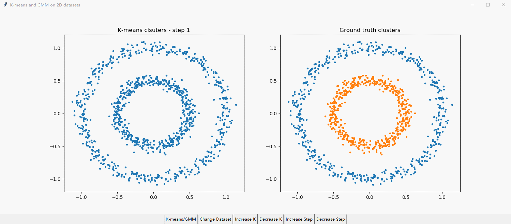
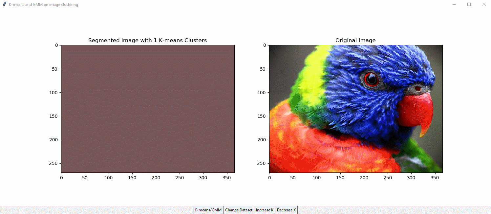
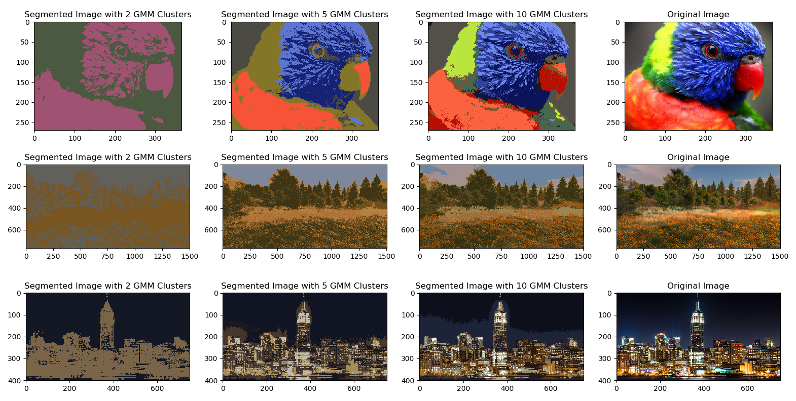

# Visualization of K-means and GMM algorithms

## Description:
This repository includes a vectorized version of K-means and GMM based on numpy; 
as well as GUIs for visualization purposes on 2D datasets and images.

## Package Requirements:
`numpy >= 1.15`

`matplotlib >= 2.2.2`

`tkinter` (For Anaconda, run `conda install -c anaconda tk` to install)

## GUI Visualization:
**GUI for K-Means and GMM on 2D datasets:**

**GUI for K-Means on image clusterings:**

**Results for GMM on image clusterings:**

## Algorithm for K-means:
1. Random initialization of cluster centers.

2. Assign all data points to their closest cluster center according to the Euclidean distance function.

3. Calculate the centroid or mean of all data points in each cluster.

4. Repeat steps 1, 2 and 3 until the same points are assigned to each cluster in consecutive rounds.

The objective function used for the algorithm is

## Algorithm for GMM:
1. Initialize the means , covariances , and mixing coefficient . Then evaluate the initial value of the log likelihood.

2. **E step**. Evaluate the responsibilities using the current parameter values:

3. **M step**. Re-estimate the parameters using the current responsibilities:

where

4. Evaluate the log likelihood:

5. Check for convergence of the log likelihood. If the convergence criterion is not satisfied, then return to step 2.

## Code Usage:
All rights preserved. No one should use the code without permission from the author.

Note that GUI for GMM is not recommended to run on personal laptops since the strict converge condition may 
make the model to take minutes until clustered images to appear, which may freeze the GUI window for a short 
amount of time. If personal laptop users want to wait for the result, make sure to close other applications 
that might consume high CPU resources.

1. Run GUI_2D_datasets.py and play with the buttons to visualize K-means and GMM algorithms on 2D datasets.
2. Run GUI_image_clusters.py and play with the buttons to visualize K-means and GMM algorithms on image clusterings.

## References:
1. [https://www.saedsayad.com/clustering_kmeans.htm](https://www.saedsayad.com/clustering_kmeans.htm)
2. [http://www.rmki.kfki.hu/~banmi/elte/bishop_em.pdf](http://www.rmki.kfki.hu/~banmi/elte/bishop_em.pdf)
